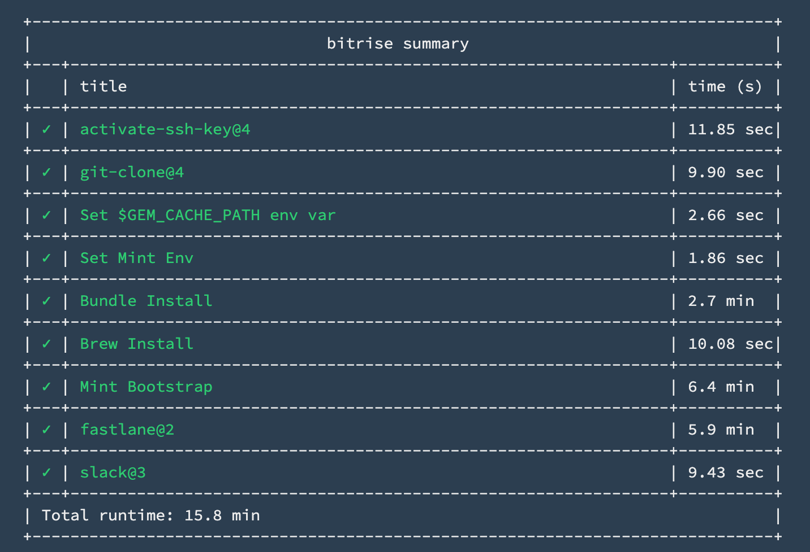
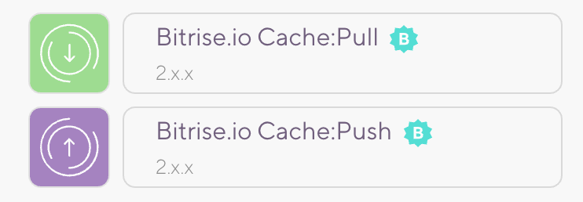
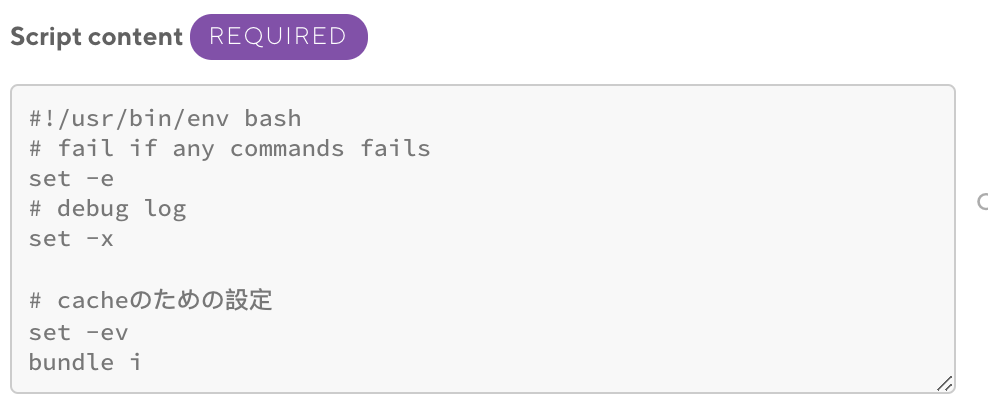
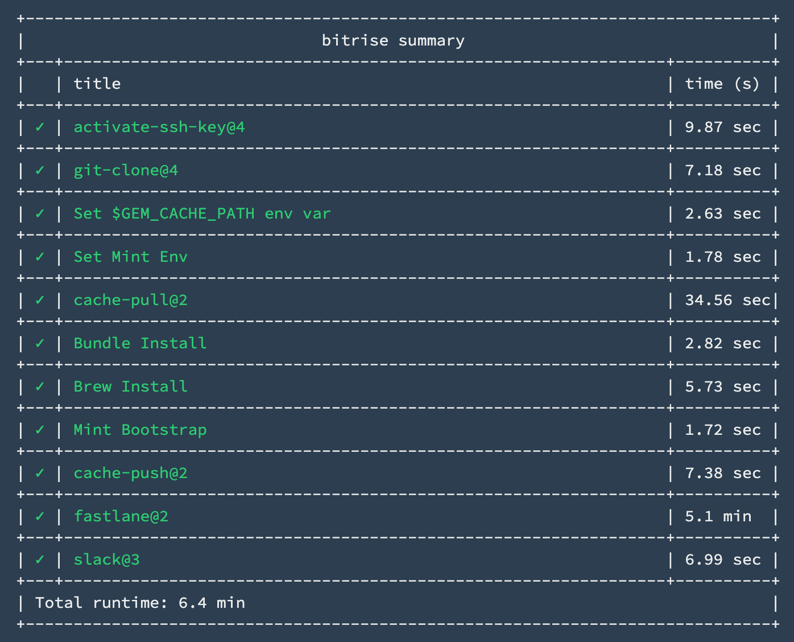

最近因為公司專案緣故深入研究了 Bitrise CI 的 cache 機制，目的是想要降低每次 commit check 的時候都要重新安裝一遍 dependencies，如 gem, homebrew, mint, pods 等等。如果是架在 Jenkins 上就會單純很多，只要管理好跑 Jenkins 的電腦上的環境即可（這裡就只專注在 Bitrise 上）。

## 套件管理工具

我們希望公司內每個 iOS 的開發環境一致，所以我們使用了以下幾個套件管理工具：

1. rbenv：管理 ruby 版本。
2. bundler：管理專案中 gem 的路徑，我們將它裝在 ./vendor/bundle 目錄底下，如此一來 ci 或其他開發者可以透過 bundle exec 來執行安裝在 working directory 底下的 gem，就不會因為 gem 版本不一樣而打架了。
3. mint：管理 SwiftLint & SwiftFormat 版本，由於 linter 每個版本的規則會略有增減，不同版本的 linter 會造成規則不同的錯誤。
4. cocoapods：可以透過 bundler 管理，大家應該都很熟悉，就不贅述了。

## 在尚未 cache 前

<p align="center"></p>

可以看到 bundle install、Brew Install、Mint Bootstrap 都會耗上幾分鐘的時間去安裝，如果可以讓這些重複執行的動作可以被 cache 住，下次執行時直接從 cache 抓，速度會變的更快！ 

---

### Bitrise Cache 機制

Bitrise 使用了自家的 cache 機制，你可以在 workflow editor 中找到 cache-pull/cache-push 兩個 step

<p align="center"></p>

在你要安裝任何 dependency 之前，或者執行 fastlane 以前，可以透過 cache-pull 將暫存的 cache 檔案抓下來。然後在每次結束 task 之前，將有更動或更新的 dependency 透過 cache-push 在存起來。

---

### Cache Gem & Bundler

由於 Bitrise 本身使用 rbenv 管理 ruby 版本，所以我們可以在專案中建立 .ruby-version 指定要使用的 ruby 版本，在此我在 .ruby-version 中指定使用 2.6.5 版本的 ruby。

再來我們不希望把安裝好的 gem commit 上 github，所以這裡使用

```shell
bundle config set path 'vendor/bundle'
```

指定 bundler 要安裝 gem 的路徑，並且透過 .gitignore 忽略掉。

---

回到 Bitrise 的 Workflow editor 新增一個 run script 如下：

```yml
- script@1:
    title: Bundle Install
    inputs:
    - content: |-
        bundle i
```

>>>`bundle i` 是 `bundle install` 的縮寫

如果不清楚要加在哪裡的話，會是在 Script content 那一欄：

<p align="center"></p>

並且在 cache-push 的 cache-paths 增加：

```yml
- cache-push:
    inputs:
    - cache_paths: |-
        # 記得把註解拿掉，bitrise 不會忽略註解，會造成路徑錯誤
        $GEM_CACHE_PATH -> ./.ruby-version # 官方文件的環境變數
        ./vendor -> ./Gemfile.lock # 當 gemfile lock 有變化時，更新 ./vendor 底下的 cache
```

當你看到以下結果時表示 gem 有成功的被 cache 住了：

```
bundle i
+ bundle i
Using CFPropertyList 3.0.2
Using concurrent-ruby 1.1.6
...
Bundle complete! 3 Gemfile dependencies, 83 gems now installed.
Bundled gems are installed into `./vendor/bundle`
```

---

### Cache Homebrew & Mint

官方推薦的方法是使用 Brew install 直接安裝需要的套件，再將 cache 打開即可。但其實有更好的方式，因為 Bitrise 內建 brew 所以我們不需要重新安裝一次，也可以透過 run script 的方式直接 `brew install xxx`。

這裡我們要做的事是把 brew 安裝套件的位置抓出來，安裝好之後透過 cache-push 做好 cache，等之後 cache-pull 時可以直接把曾經安裝好的 brew 套件裝回來，第二次執行 brew install 的時候透過 link 的方式直接 link 到 cache 裡的套件。

所以這裡我們有幾件事要做：

1. 先設定要 cache 的 brew 套件環境變數

```yml
- script:
    title: Set Env Path
    inputs:
    - content: |-
        # 增加我們要 cache 的 brew 套件環境變數，如果有使用到其他的套件，請再手動增加
        envman add --key BREW_MINT --value "$(brew --cellar)/mint" # 指定套件名稱位置
        envman add --key BREW_OPT_MINT --value "/usr/local/opt/mint"  # 指定套件名稱位置，此為 file alias
```

>>> echo "$(brew --cellar)" 可以取得 brew 安裝套件位置

2. 手動執行 Brew Install

由於我們不走 Bitrise 提供給我們的 Brew Install，在此我們要新增一個 run script：

```yml
- script:
    title: Brew install
    inputs:
    - content: |-
        # 執行上述的 install 方法，沒有套件則先安裝，有的話直接 link cache 中的套件
        brew install mint
        brew link mint
```

3. 記得新增 cache-paths

```yml
- cache-push:
    inputs:
    - cache_paths: |-
        $BITRISE_CACHE_DIR
        ...

        # 新增以下 cache_path
        $BREW_MINT
        $BREW_OPT_MINT
```

成功後就會看到

```
+ brew install mint
Warning: mint 0.14.2 is already installed, it's just not linked
You can use `brew link mint` to link this version.
+ brew link mint
Linking /usr/local/Cellar/mint/0.14.2... 1 symlinks created
```

---

### Cache SwiftLint & SwiftFormat

再來執行 task 時會發現每次 mint 要 bootstrap 把需要的套件安裝起來後，每次都要等很久，是因為 cache brew 套件並不會把 mint 安裝過的套件也一併 cache 住。

原因是 mint 把透過 mint 安裝的套件安裝在 `/usr/local/lib/mint` 底下，所以我們可以在上面設定環境變數的地方再加上

```yml
envman add --key MINT_PACKAGES --value "/usr/local/lib/mint"
```

然後在 cache-push 的 cache-paths 新增：

```yml
- cache-push:
    inputs:
    - cache_paths: |-
        ...

        # 新增
        $MINT_PACKAGES
```

成功後就會看到：

```
+ mint bootstrap
🌱 2 packages up to date
```

Mint 不會再 compile 一次浪費時間。

---

### 結果比較

原先要執行 15.8 分鐘

<p align="center"></p>

變成只要 6.4 分鐘

<p align="center"></p>

- Bundle install 2.7 min -> 2.8 sec
- Mint Bootstrap 6.4 min -> 1.72 sec

每次 commit push 都可以省下將近 10 分鐘的時間，長久累積下來絕對不是個小數目。

---

### 參考資源

[[iOS] Bitriseのキャッシュをできるだけ生かしてCI / CDの高速化を図る - @Kazuma_Nagano](https://qiita.com/Kazuma_Nagano/items/502c1733f1b6da3a9073)

[Bitriseで gemとbrewのキャッシュ - @yosshi4486](https://qiita.com/yosshi4486/items/cca97bf84e0be71569ee_)