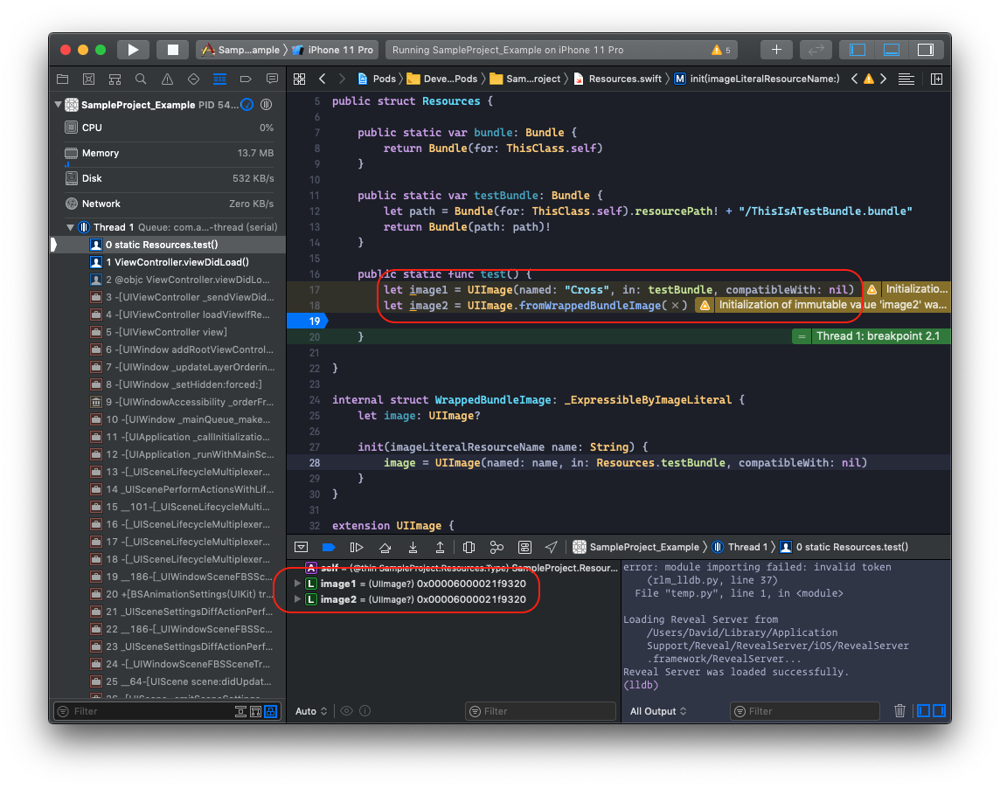

在 Cocoapods 管理圖片、聲音、影片等等資源會跟原本在 xcode project 中不太一樣，我們來看一下如何在 Cocoapods 中新增這些資源。

Cocoapods 提供了兩種方式給我們管理資源，可以在 `.podspec 中設定`：

1. s.resources
2. s.resource_bundles

## resources

透過 resources 我們可以將指定資料夾中的指定資料 `"單純的 copy 至 framework 之中"`

```ruby
s.resources = [
  '<YOUR_PROJECT_NAME>/Assets/*.png', # for all pngs
  '<YOUR_PROJECT_NAME>/Assets/*.m4a', # for all audios
  # and so on...
]
```

在此我們要檢查一下這些檔案被用什麼樣的方式複製到 `.framework` 之中，因此我們必須先知道該 bundle 的 file directory 在哪裡，可以先抓到該 framework 的 bundle，再取其 path。

```swift
import Foundation

fileprivate class ThisClass {}

public struct Resources {
    public static var bundle: Bundle {
        get {
            return Bundle(for: ThisClass.self)
        }
    }
}
```

將建立 pod 時產生的 example 跑起來，再把 bundle path 印出來：

```lldb
(lldb) p Resources.bundle.resourcePath
(String?) $R1 = "/Users/David/Library/Developer/CoreSimulator/Devices/709C7C0A-458D-49CD-8681-DE7E767DC53E/data/Containers/Bundle/Application/559E93DC-DB45-4FF0-B025-A8FBCBF83601/SampleProject_Example.app/Frameworks/SampleProject.framework"
```

取得 bundle path 之後，我們 cd 至該目錄可以看到，我們放進去的圖片資源單純的被複製到 framework 之中：

<p align="center">
  
</p>

---

## resource_bundles

那如果我的圖片要支援 @1x, @2x, @3x 呢？

在 `*.xcassets` 之中，我們可以將各個尺寸的圖片放進去，接著從 appstore 下載的時候會自動依照裝置的大小來決定要下載哪一個尺寸的圖片，進而達到節省 app 大小與網路資源的成效。

如果要在 Cocoapods 中加入 `*.xcassets` 就需要用到 `resource_bundles` 了。

我們可以在 Assets 資料夾中建立一個新的資料夾 `<ASSETS_NAME>.xcassets`（切記結尾要是 `.xcassets`，建立好沒有看到該資料夾可能要重新 `pod install` 一次）再把有分尺寸的圖片丟進去即可：

<p align="center">
  
</p>


在此我們可以建立很多個 bundle，且每一個 bundle 可以放入不一樣的資源（但要切成很多個 bundle 也會造成未來在存取的時候，必須先知道該資源的 bundle 位置才能存取，可能會造成混淆）：

```ruby
s.resource_bundles = {
 'ThisIsATestBundle' => ['SampleProject/Assets/*.xcassets']
}
```

一樣 pod install 之後將 example 跑起來印出 bundle resourcePath，此時在這個路徑中我們會看到一個新的 bundle：

<p align="center">
  
</p>

且可以看到該 bundle 中有一個 `.car` 檔：

<p align="center">
  
</p>

這個檔案可以讓 appstore 可以依據裝置大小決定要下載的圖片資源。

---

## 如何讀取 `*.xcassets` 中的圖片呢？

讓我們用一般的方式直接讀取剛剛放到 `*.xcassets` 中的圖片：

<p align="center">
  
</p>

會發現到用 `UIImage.init(named:)` 會取得 nil，且用 Image Literal 取會直接閃退！因為使用了 `resource_bundles` 會讓資源不是放在 `./` 目錄底下，而是放在 `ThisIsATestBundle.bundle` 底下。因此我們要抓到我們剛才新增的 `ThisIsATestBundle.bundle`

```swift
fileprivate class ThisClass {}

public struct Resources {
    public static var testBundle: Bundle {
        let path = Bundle(for: ThisClass.self).resourcePath! + "/ThisIsATestBundle.bundle"
        return Bundle(path: path)!
    }
}
```

這個 `testBundle` 才是存放圖片資源的位置（記得後面的 bundle name 要根據你設定的名字更改）。

### 使用 Image Literal 讀取圖片

```swift
internal struct WrappedBundleImage: _ExpressibleByImageLiteral {
    let image: UIImage?

    init(imageLiteralResourceName name: String) {
        image = UIImage(named: name, in: <ANY_BUNDLE>, compatibleWith: nil)
    }
}

extension UIImage {
    static func fromWrappedBundleImage(_ wrappedImage: WrappedBundleImage) -> UIImage? {
        return wrappedImage.image
    }
}
```

>>參考：https://stackoverflow.com/questions/41834472/xcode8-usage-of-image-literals-in-frameworks

### 使用 UIImage(named:) 讀取圖片

要使用存放該圖片資源的 bundle 來讀取圖片：

```swift
UIImage(named: "Cross", in: <ANY_BUNDLE>, compatibleWith: nil)
```

再執行一次 example 就可以看到圖片被成功讀取出來了：
<p align="center">
  
</p>

---

## 注意事項

由於

```swift
struct WrappedBundleImage: _ExpressibleByImageLiteral { ... }
```

使用了 `_ExpressibleByImageLiteral` 使用了 private api，不確定審核的時候會不會被 apple 擋下來，可能要注意一下（但感覺這個 private api 沒有繞過什麼或者作弊之類的，可能不會有問題）
