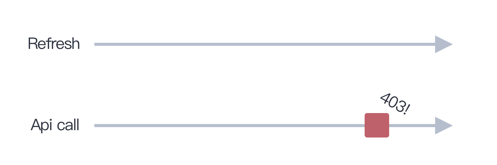
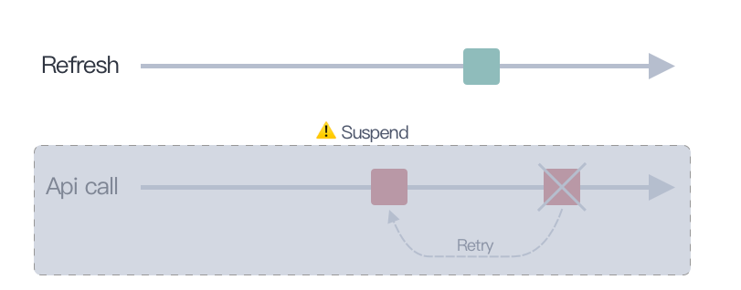
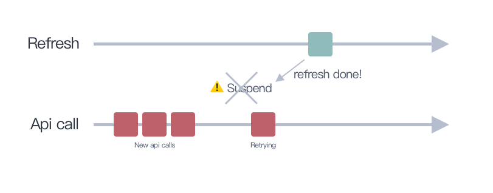

# What is OAuth?
網路上關於 OAuth 2.0 的文章很多，包含 Facebook 的 access token 也是類似這樣的機制，這邊不贅述了。

>>>可以參考：(關於OAuth 2.0-以Facebook為例 - Justin Lee)(https://medium.com/@justinlee_78563/%E9%97%9C%E6%96%BCoauth-2-0-%E4%BB%A5facebook%E7%82%BA%E4%BE%8B-6f78a4a55f52)

## 當 Access Token 過期

Access Token 在某些情況下會失效
- Server 主動 revoke access token
- Access token 超過可以運作的時效（過期）

這時我們就要拿 refresh token 去向 server 換取一組新的 access token 跟 refresh token。

## 使用 refresh token 換取新的 access token
**什麼情況下我們會想要使用 refresh token 去換一組新的 access token 呢？**
1. 也許是 access token 快過期的時候
2. 或是 api response 回了 401 403 之類 unauth 的 error code 給我們的時候

**而使用 refresh token 去換一組新的 access token，可能要注意：**
1. 手機是否有網路，已經失敗的 api 是不是要 retry？
2. 是不是要在 api 取得 401 403 error code 時觸發 refresh token 機制？
3. refresh token 一次只能執行一次（同一組 refresh token 換兩次 access token 會掛掉）

---

# 情況如此複雜，我們如何處理 token refresh 機制？
其實要處理以上的狀況並不會太難，首先需要先確保你能實作以下兩個輔助機能：

## 1. api call 必須要能 retry
當 api 取得 401 403 error code 時，我們需要觸發 refresh 機制，同時把失敗的 api call 放到 retry pool 中，等到 refresh 完成後，再重新執行一次。

## 2. api call 必須能被暫停
當 refresh 機制運作中，所有的 api call 都要被暫停住，等到 refresh 完成後才放行。

>>>> 沒有網路的狀況 api call 以及 refresh 機制都無法動作，所以不會在沒有網路的狀態下將使用者登出。因為無從得知 access token & refresh token 雙雙失效。（只有在 refresh token 也失效的狀態下，才需要將使用者登出）


我們來看如果某一個 api 回了 403 給我們，會發生什麼事



依照上面的設計思路，我們會暫停 api call thread，同時處發 refresh 機制還有 retry 失敗的 api call



即使在 refresh 時會花 10 秒鐘的時間去取得新的 access token & refresh token，且在這個期間又有新的 api call 觸發，所有的 api call（新的 or 失敗重試的），都會等到 refresh 完成後才開始動作。



---

# 來看點 Code 吧

## 關於 Retry
我使用了 PromiseKit 來幫我處理 callback 問題，同時 PromiseKit 也能處理 [retry](https://github.com/mxcl/PromiseKit/blob/master/Documentation/CommonPatterns.md#retry--polling) 的部分

```swift
func attempt<T>(maximumRetryCount: Int = 3, delayBeforeRetry: DispatchTimeInterval = .seconds(2), _ body: @escaping () -> Promise<T>) -> Promise<T> {
    var attempts = 0
    func attempt() -> Promise<T> {
        attempts += 1
        return body().recover { error -> Promise<T> in
            guard attempts < maximumRetryCount else { throw error }
            return after(delayBeforeRetry).then(on: nil, attempt)
        }
    }
    return attempt()
}

attempt(maximumRetryCount: 3) {
    yourApiGoesHere() // api 是個 promise
}.then {
    //…
}.catch { _ in
    // we attempted three times but still failed
}
```

>>> 如果使用 Rx 的話，就要使用 [RxSwiftExt](https://github.com/RxSwiftCommunity/RxSwiftExt) 提供的 retry 方法（原本 Rx 提供的 retry 並沒有辦法等待一段時間才重試，不符合我們的需求）

## 關於 api call 暫停
這邊相對簡單很多，`DispatchQueue` 提供我們一個可以暫停 thread 的方法：

```swift
let requestQueue: DispatchQueue = DispatchQueue(label: "com.hello.request_queue")
requestQueue.suspend() // 暫停 thread
requestQueue.resume() // 重新啟動 thread
```

於是我們可以把所有的 api call 放到該 thread 執行，當 refresh 機制一被觸發，就可以把該 thread 暫停住。（記得不要把 refresh 機制也放到該 thread 中了，不然 refresh 永遠不會成功）

---

# 結語

看到這邊會不會覺得很困惑，為什麼沒有提到太多程式面的部分呢？這就要取決於你的網路層是怎麼建構的了，以上的條件都必須滿足，才會比較好做到上面講的 refresh 機制。

會使用 PromiseKit 的原因不外乎就是可以解決 callback 問題，且如果你的 api call 被包成 promise 後，要再加上 retry 機制相對就簡單很多了。

再來我會使用 [Moya](https://github.com/Moya/Moya) 來輔助我做 refresh 機制，他的 [plugin 機制](https://github.com/Moya/Moya/blob/master/docs/Plugins.md)允許我們對一個 request 做預處理或後處理（pre/post process），這樣的好處在於，如果我的 api call 拿到 401 403 等錯誤後，我馬上能觸發 refresh 機制，並且同時 suspend request thread 暫停所有的 api call。

```swift
public func didReceive(_ result: Result<Moya.Response, MoyaError>, target: TargetType) {
    // check 401 403 here
}
```

---

參考資料：
- [Moya OAuth](https://github.com/Moya/Moya/blob/master/docs/Authentication.md#oauth)
- [Trivago Heimdallr](https://github.com/trivago/Heimdallr.swift)
