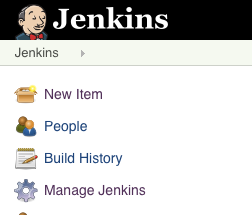
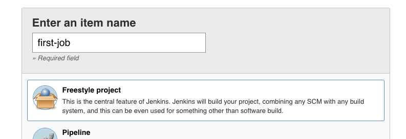
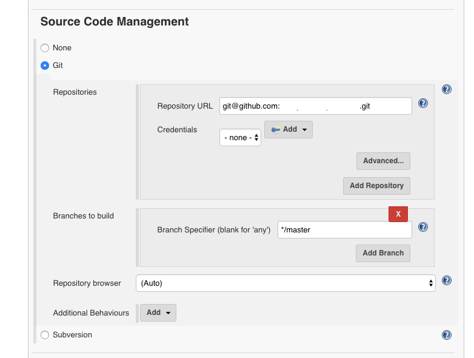
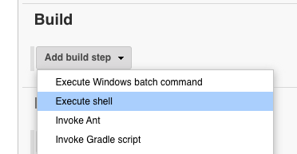
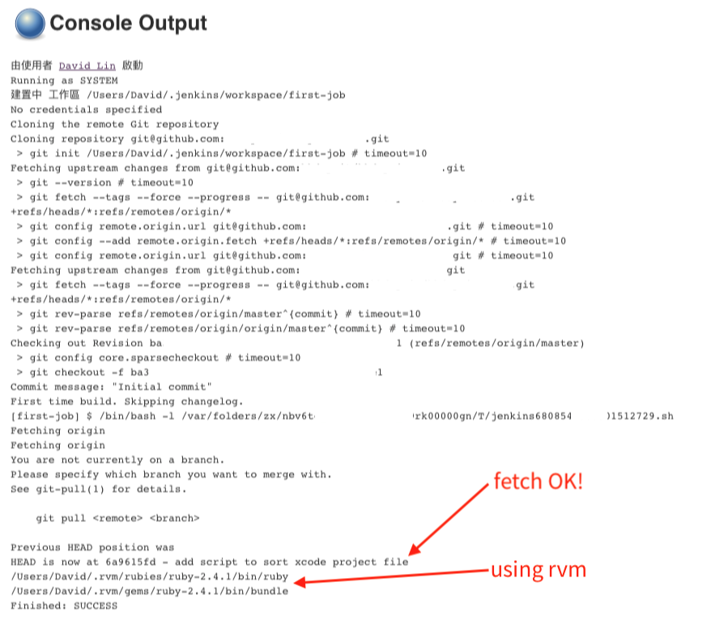

# Homebrew
[Homebrew](https://brew.sh/index_zh-tw) 是一個類似於 apt-get 且屬於 macOS 的套件管理工具，等等我們會使用 Homebrew 來安裝 Jenkins。

### 安裝 Homebrew
```bash
$ /usr/bin/ruby -e "$(curl -fsSL https://raw.githubusercontent.com/Homebrew/install/master/install)"
```

# rvm
rvm 是用來管理電腦上 ruby 的工具（如果你想要用系統 ruby 或者其他管理 ruby 的工具可以自行安裝）

rvm: https://rvm.io/

```bash
\curl -sSL https://get.rvm.io | bash -s stable
```

# Fastlane 設定
可以參考：
[Fastlane + GitLab + Bitrise on iOS](https://medium.com/@davidlin_98861/fastlane-gitlab-bitrise-on-ios-6275bdf929be)

# Jenkins
## 安裝 Jenkins
這邊我們有兩個方式可以把 Jenkins 安裝到 Mac 上，一個是透過 Jenkins 官方下載的 `.pkg` 檔案安裝，二是透過 Homebrew 安裝。

兩者最大的差異是使用 `.pkg` 安裝的話，他會在 `/Users/Shared/` 的路徑底下再新建一個叫做 `Jenkins` 的使用者，這會使你的電腦多增加一個使用者，再加上他的裝載點是在 `/Users` 底下，因此會抓不到 rvm。

如果使用 `Homebrew` 安裝的話，他會在你的家目錄建立一個檔案： `/Users/<YOUR_USER>/.jenkins`，這樣的好處是 jenkins 可以觸及 rvm 裡面安裝的 ruby。（還有路徑上的問題也會少很多，有興趣者可以參考 [macOS 上使用 Jenkins 搭建 Android/iOS 持续集成环境](https://www.ifeegoo.com/using-jenkins-to-set-up-the-continuous-integration-environment-of-android-and-ios-on-macos.html)）

我們可以透過以下指令來安裝 Jenkins：
```bash
$ brew install jenkins
```

或者你想要安裝穩定版本的 Jenkins：
```bash
$ brew install jenkins-lts
```

安裝成功的話會有以下結果：
```shell
$ brew install jenkins
==> Downloading http://mirrors.jenkins.io/war/2.195/jenkins.war
Already downloaded: /Users/David/Library/Caches/Homebrew/downloads/b929ae9e89a6083706dcec80dd42fb9abac3f571e3293ea724e091df4fe58348--jenkins.war
==> jar xvf jenkins.war
==> Caveats
Note: When using launchctl the port will be 8080.

To have launchd start jenkins now and restart at login:
 brew services start jenkins
Or, if you do not want/need a background service you can just run:
 jenkins
==> Summary
🍺  /usr/local/Cellar/jenkins/2.195: 7 files, 78.2MB, built in 6 seconds
```

## 啟動 Jenkins
使用 `brew services start` 可以啟動安裝在 Homebrew 底下的一些服務，要啟動 Jenkins 的話可以這樣做：
```bash
$ brew services start jenkins # or jenkins-lts
```

要停止服務的話：
```bash
$ brew services stop jenkins # or jenkins-lts
```

接著就可以連線到 Jenkins 囉：http://localhost:8080

## 設定 Jenkins

連進 Jenkins 的第一個畫面話詢問你密碼，主要是想要確認你有沒有 sudo 的權限，我們可以在 terminal 裡面把密碼找出來：
```bash
$ sudo cat /Users/<YOUR_NAME>/.jenkins/secrets/initialAdminPassword
17cab4eac7504be287dfd7dd345d85d5
```
再使用這組密碼登入 Jenkins 即可。

輸入密碼後你會看到這個畫面：


你可以只先輸入 user name 跟 password，這將是你等等進入 jenkins 的第一組帳號密碼。

>如果你一直卡在 `Offline. This Jenkins instance appears to be offline.` 畫面，且還沒有要 host 到某台主機上，只是要本機端測試，你可以參考這個解決方案：https://stackoverflow.com/questions/42408703/why-does-jenkins-say-this-jenkins-instance-appears-to-be-offline

>修改 `/Users/<YOUR_NAME>/.jenkins/hudson.model.UpdateCenter.xml` 檔案，把原本使用 `https` url 改成 `http` 即可。要記得重新啟動 Jenkins：
>```bash
>$ brew service restart jenkins
>```

## 安裝 Jenkins Plugins

接著可以安裝一些輔助插件，讓 Jenkins 功能更加齊全：


選擇推薦的插件安裝：


## 走完剩下的步驟

接著建一個使用者：


設定暫時性的網址：


好！！


## SSH key
由於我們的 code 都會從 github SSH 來，所以必須建立一個 ssh key，建立方式請見 [BitBucket - Set up an SSH key](https://confluence.atlassian.com/bitbucket/set-up-an-ssh-key-728138079.html)

並且交給 Jenkins 保管。

## 建立第一個任務



選擇左上角的「新任務」，並且建立一個 free style project：



填上 repo 的地址：



填好之後往下繼續會看到 Build Triggers，這裡可以設定建置排程，等等會提到。

再來我們要寫要讓這個排程執行的 shell script：



一開始先檢查 Jenkins 是否可以正確抓到 rvm 跟 bundler，並且一併把某個 feature branch 的資料 pull 下來，檢查 ssh key 是否可用：

```bash
#!/bin/bash -l
export LC_ALL=en_US.UTF-8;
export LANG=en_US.UTF-8;

git fetch --all
git pull --all
git checkout origin/feature/SCMA-284-fastlane-cicd

which ruby
which bundle
```

接著按下儲存後按下 左側的 build now 馬上執行 job。

如果這個 job 可以成功 fetch/pull 就代表 Jenkins 有權限能存取你的 github repo，且同時使用 rvm 的 ruby 跟 bundler 來安裝 gem。



## 執行 fastlane
由於我的電腦上裝了兩個版本的 ruby：
```bash
$ rvm list
   ruby-2.4.1 [ x86_64 ]
=* ruby-2.6.3 [ x86_64 ]
```

不過我們希望在執行 jenkins 中的 fastlane 是使用 ruby 2.4.1 版本執行，我們可以使用 `rvm use` 來切換 ruby 版本。接著我們要使用 bundle 安裝 gem（包含 fastlane, cocoapods）把相依的套件安裝起來，接著我們要透過安裝好的 fastlane 來跑設定好的 lane：

```bash
#!/bin/bash -l
export LC_ALL=en_US.UTF-8;
export LANG=en_US.UTF-8;

git fetch --all
git pull --all
git checkout origin/feature/SCMA-284-fastlane-cicd

rvm use 2.4.1
bundle i
bundle exec fastlane beta
```

再來再按下 build now，就可以看到 fastlane 開始跑囉！

---

### 注意事項
#### Unlock keychain
因為我們的 jenkins 必須架設在 macOS 環境中，再以 fastlane 去操作 xcode build 打包 ipa，所以經過 code sign 時會需要你打 keychain 的密碼，可以 unlock Jenkins 機器上的 keychain 或者「永遠允許」存取密碼。

#### /!#bin/bash -l 原因
`-l` 是 `--login` 的縮寫，使用 `/!#bin/bash -l` 當開頭話， bash 會去找你的 .bashrc or .zshrc 檔案（幫你做一次 source ~/.xxxrc），如果你有遇到找不到 bundle 的問題，可以試試看這著方式。

#### Uninstall Jenkins
由於我們的 Jenkins 是透過 Homebrew 安裝的，所以在 `'/Library/Application Support/Jenkins/Uninstall.command'` 目錄底下會找不到 uninstall command。

除了要移除 Homebrew 中的 jenkins 以外，還要移除家目錄底下產生的 jenkins 資料檔案也移除，才是真的完整移除 jenkins。（如果想要保留 jenkins 上的資訊，可以保留 ~/.jenkins 資料夾底下的東西）
```bash
$ brew uninstall jenkins # or jenkins-lts
$ rm -rf ~/.jenkins # 移除所有 jenkins 相關資料
```
