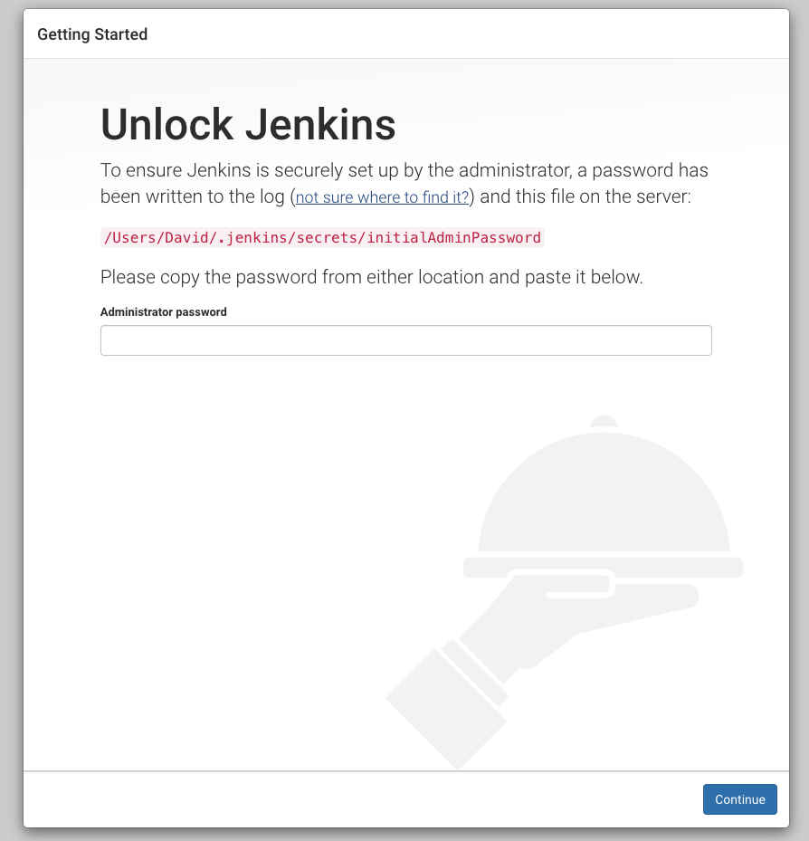
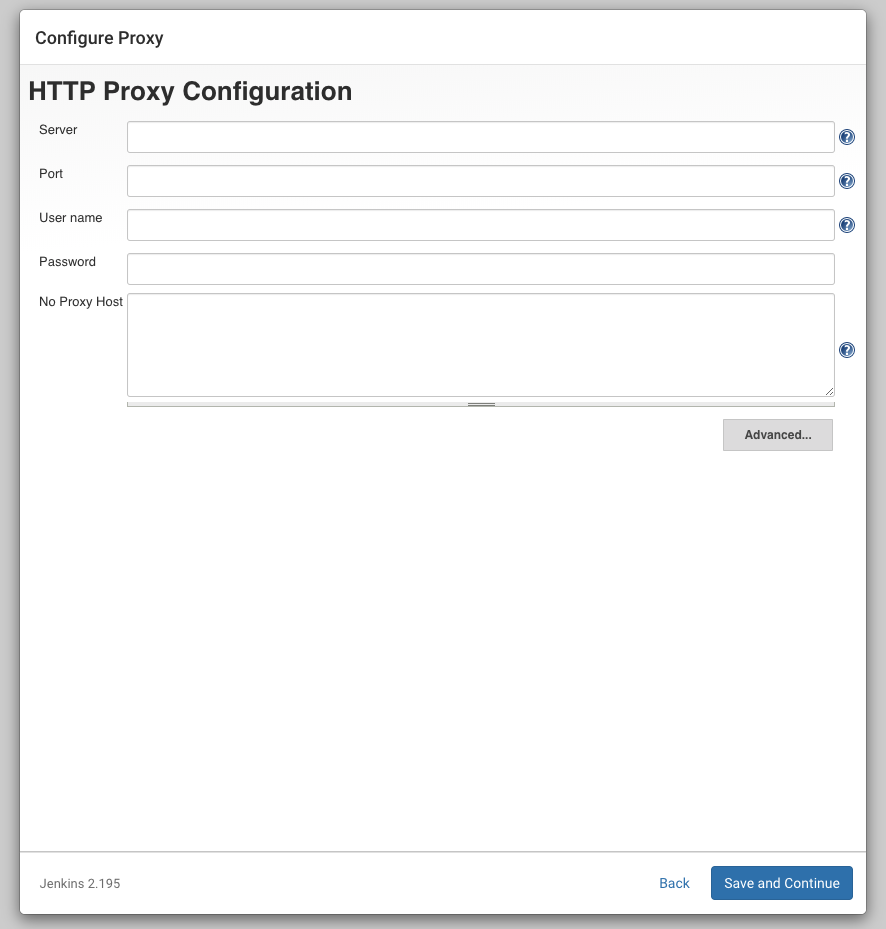
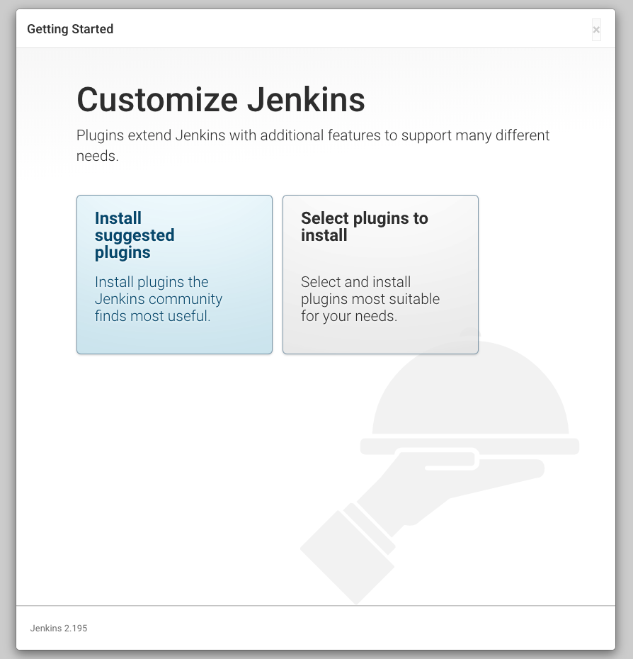
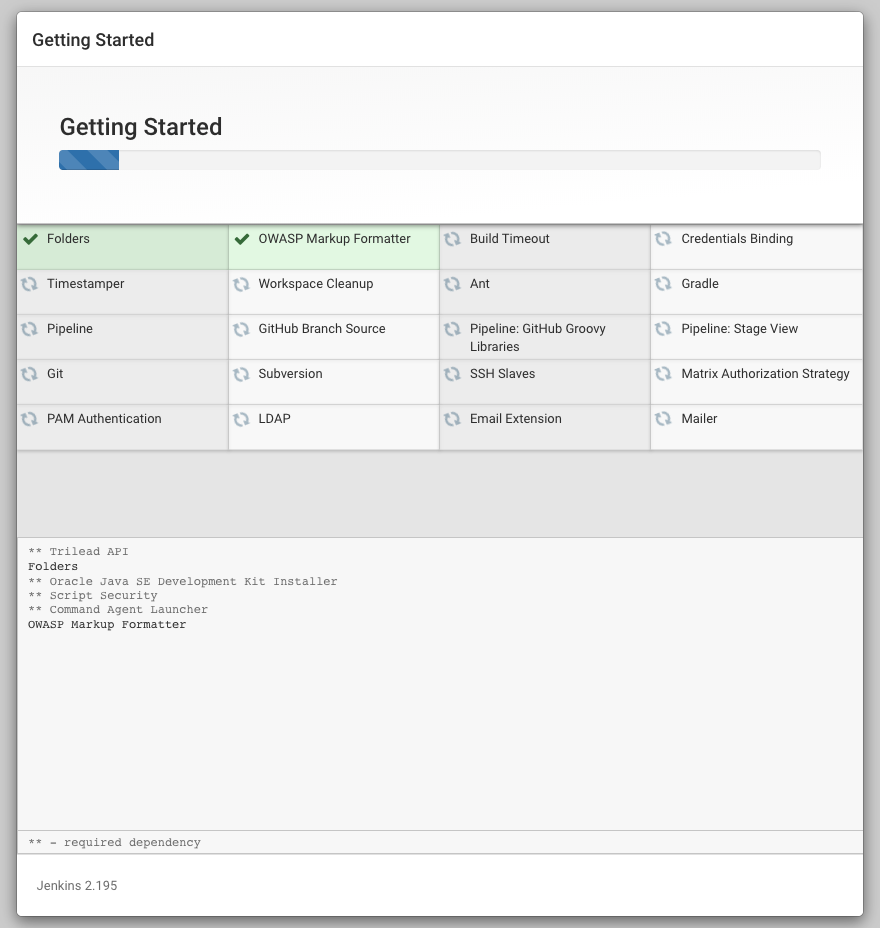
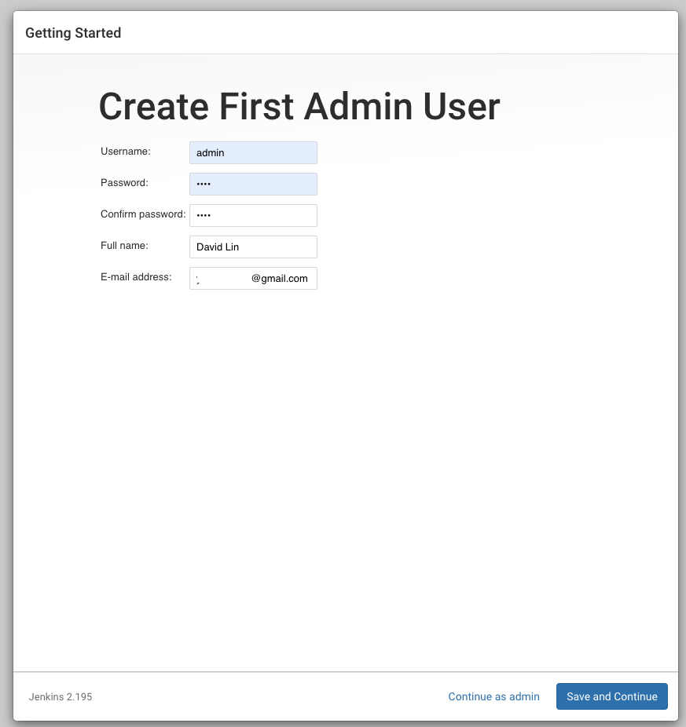
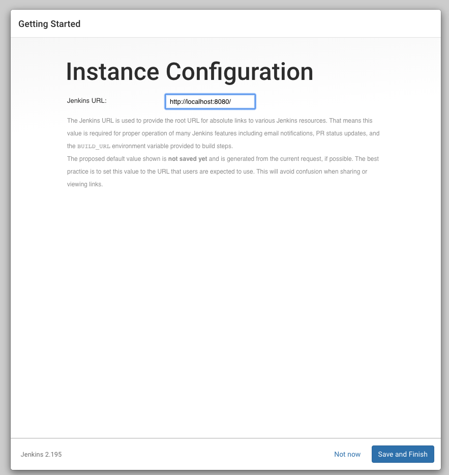
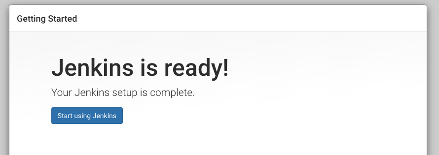

# Homebrew

# rvm

# Fastlane 設定

# Jenkins
## 安裝 Jenkins
這邊我們有兩個方式可以把 Jenkins 安裝到 Mac 上，一個是透過 Jenkins 官方下載的 `.pkg` 檔案安裝，二是透過 Homebrew 安裝。

兩者最大的差異是使用 `.pkg` 安裝的話，他會在 `/Users/Shared/` 的路徑底下再新建一個叫做 `Jenkins` 的使用者，這會使你的電腦多增加一個使用者，再加上他的裝載點是在 `/Users` 底下，因此會抓不到 rvm。

如果使用 `Homebrew` 安裝的話，他會在你的家目錄建立一個檔案： `/Users/<YOUR_USER>/.jenkins`，這樣的好處是 jenkins 可以觸及 rvm 裡面安裝的 ruby。（還有路徑上的問題也會少很多，有興趣者可以參考 [macOS 上使用 Jenkins 搭建 Android/iOS 持续集成环境](https://www.ifeegoo.com/using-jenkins-to-set-up-the-continuous-integration-environment-of-android-and-ios-on-macos.html)）

我們可以透過以下指令來安裝 Jenkins：
```bash
$ brew install jenkins
```

或者你想要安裝穩定版本的 Jenkins：
```bash
$ brew install jenkins-lts
```

安裝成功的話會有以下結果：
```shell
$ brew install jenkins
==> Downloading http://mirrors.jenkins.io/war/2.195/jenkins.war
Already downloaded: /Users/David/Library/Caches/Homebrew/downloads/b929ae9e89a6083706dcec80dd42fb9abac3f571e3293ea724e091df4fe58348--jenkins.war
==> jar xvf jenkins.war
==> Caveats
Note: When using launchctl the port will be 8080.

To have launchd start jenkins now and restart at login:
 brew services start jenkins
Or, if you do not want/need a background service you can just run:
 jenkins
==> Summary
🍺  /usr/local/Cellar/jenkins/2.195: 7 files, 78.2MB, built in 6 seconds
```

## 啟動 Jenkins
使用 `brew services start` 可以啟動安裝在 Homebrew 底下的一些服務，要啟動 Jenkins 的話可以這樣做：
```bash
$ brew services start jenkins # or jenkins-lts
```

要停止服務的話：
```bash
$ brew services stop jenkins # or jenkins-lts
```

接著就可以連線到 Jenkins 囉：http://localhost:8080

## 設定 Jenkins

連進 Jenkins 的第一個畫面話詢問你密碼，主要是想要確認你有沒有 sudo 的權限，我們可以在 terminal 裡面把密碼找出來：
```bash
$ sudo cat /Users/<YOUR_NAME>/.jenkins/secrets/initialAdminPassword
17cab4eac7504be287dfd7dd345d85d5
```
再使用這組密碼登入 Jenkins 即可。

輸入密碼後你會看到這個畫面：



你可以只先輸入 user name 跟 password，這將是你等等進入 jenkins 的第一組帳號密碼。

>如果你一直卡在 `Offline. This Jenkins instance appears to be offline.` 畫面，且還沒有要 host 到某台主機上，只是要本機端測試，你可以參考這個解決方案：https://stackoverflow.com/questions/42408703/why-does-jenkins-say-this-jenkins-instance-appears-to-be-offline

>修改 `/Users/<YOUR_NAME>/.jenkins/hudson.model.UpdateCenter.xml` 檔案，把原本使用 `https` url 改成 `http` 即可。要記得重新啟動 Jenkins：
>```bash
>$ brew service restart jenkins
>```

## 安裝 Jenkins Plugins

接著可以安裝一些輔助插件，讓 Jenkins 功能更加齊全：



選擇推薦的插件安裝：



## 走完剩下的步驟

接著建一個使用者：



設定暫時性的網址：



好！！



## SSH key

## 建立第一個任務

---

### 注意事項
#### Unlock keychain

#### /!#bin/bash -l 原因

#### Uninstall Jenkins
由於我們的 Jenkins 是透過 Homebrew 安裝的，所以在 `'/Library/Application Support/Jenkins/Uninstall.command'` 目錄底下會找不到 uninstall command。

除了要移除 Homebrew 中的 jenkins 以外，還要移除家目錄底下產生的 jenkins 資料檔案也移除，才是真的完整移除 jenkins。（如果想要保留 jenkins 上的資訊，可以保留 ~/.jenkins 資料夾底下的東西）
```bash
$ brew uninstall jenkins # or jenkins-lts
$ rm -rf ~/.jenkins # 移除所有 jenkins 相關資料
```
